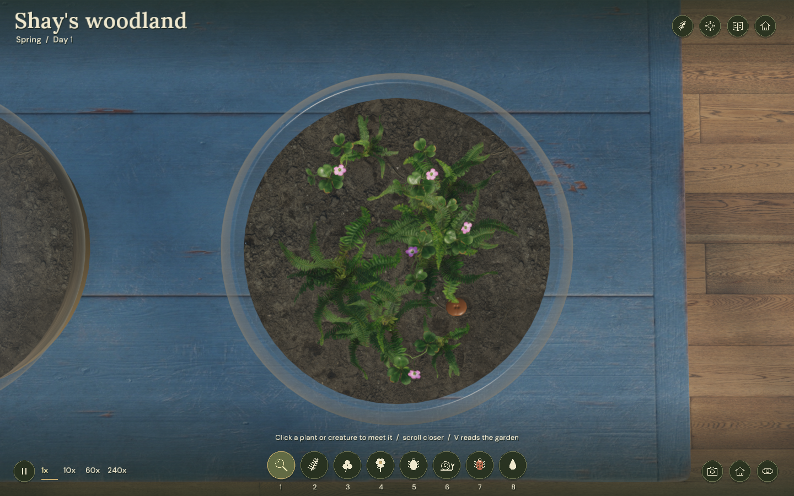

# little world

A greenhouse, a few living gardens, and time to tend them.



Built with [sengine](https://github.com/ImArjunJ/sengine) and [simulates](https://github.com/ImArjunJ/simulates).

```sh
git clone --recurse-submodules https://github.com/ImArjunJ/little-world.git
cd little-world
./vendor/sengine/tools/fetch_filament.sh
./run.sh
```

Clang with libc++, CMake 3.24+, SDL3 3.2+, FreeType and libpng. Linux defaults to OpenGL; macOS uses Metal. The engine also supports GLFW and Vulkan through its CMake options. Assets are included. Saves use your platform’s application-data directory, or `$XDG_DATA_HOME/little-world`.

WASD to walk. E to tend, F to lift, J for the journal. Escape to return.
